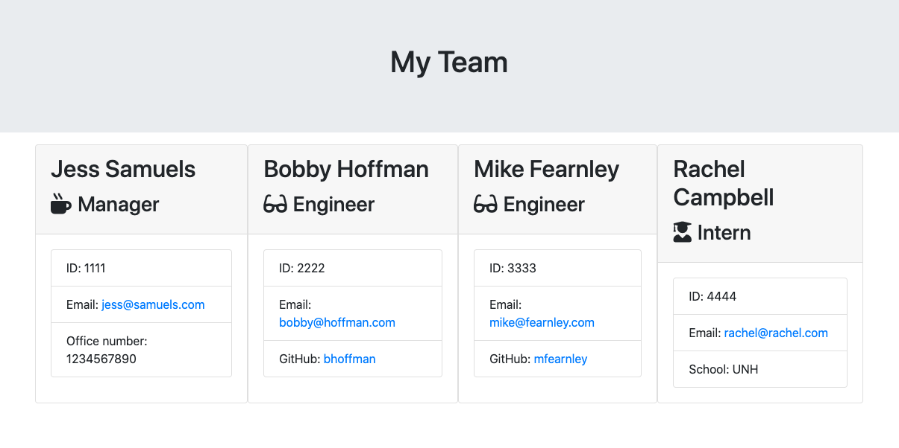
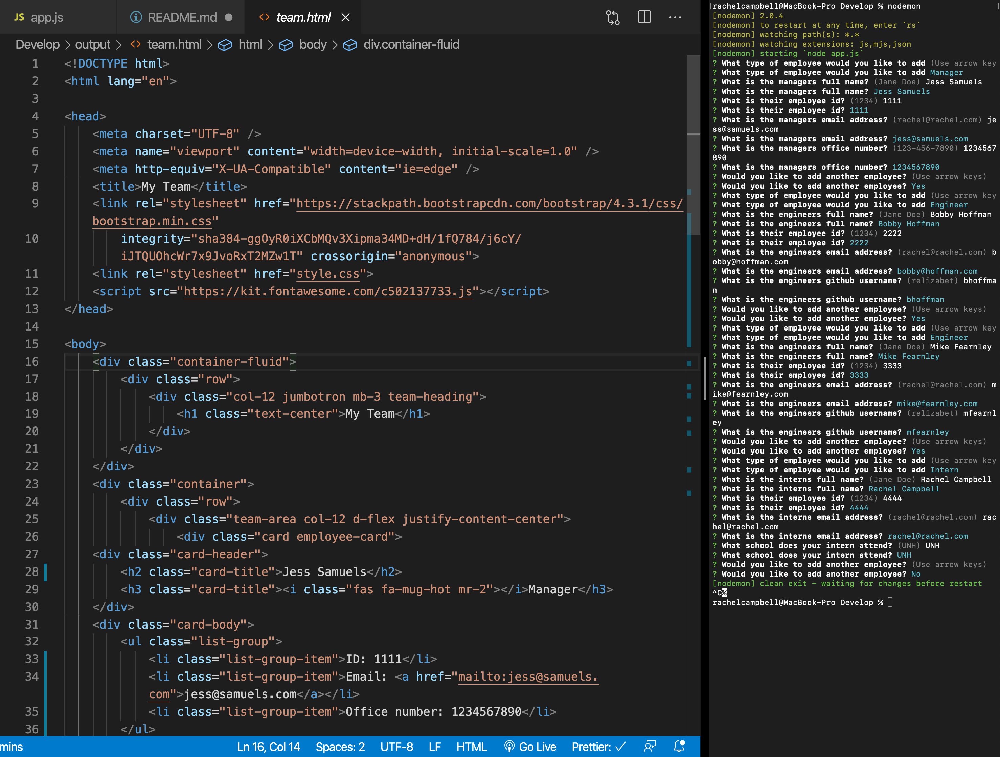
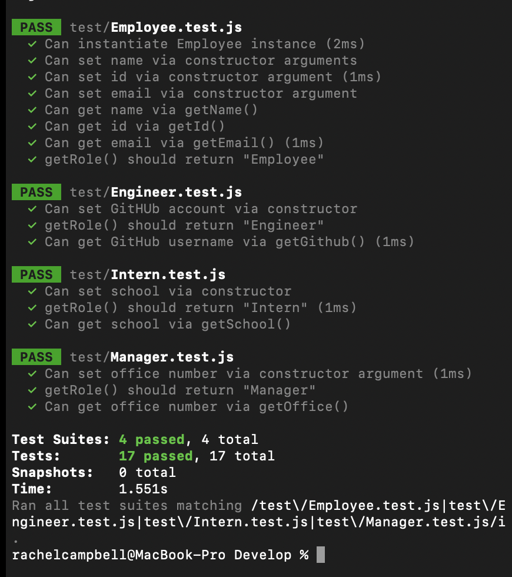

# Employee Summary

[](https://opensource.org/licenses/MIT)

## Description

This is a node.js CLI that builds a team based on user input.

### User Story

```
As a manager
I want to generate a webpage that displays my team's basic info
so that I have quick access to emails and GitHub profiles
```

## Table of Contents

- [Employee Summary](#employee-summary)
  - [Description](#description)
    - [User Story](#user-story)
  - [Table of Contents](#table-of-contents)
  - [Installation](#installation)
  - [Usage](#usage)
  - [Built With](#built-with)
  - [License](#license)
  - [Contributing](#contributing)
  - [Testing](#testing)
  - [Contact](#contact)

## Installation

This application is initialized in the terminal with the command `node app.js`.

## Usage

The user is prompted with a series of questions used to fill out the README template. The application will also generate a `.md` file based on what License is chosen by the user.







A video of the CLI being used can be viewed [here](https://youtu.be/LSRrgaZ5jvk).

## Built With

- JavaScript
- Node.js

## License

[MIT](./LICENSE.md)

## Contributing

To contribute to this project create a branch with the feature or correction then submit a pull request.

## Testing

No tests have been created for this application at this time.

## Contact

Please direct any questions or concerns directly to me via my email address listed below.

- Github: [relizabet](https://github.com/relizabet)
- Email: rachel@relizabeth.com
